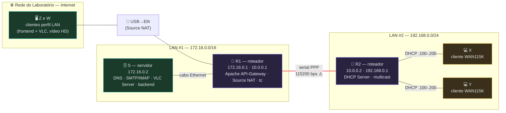
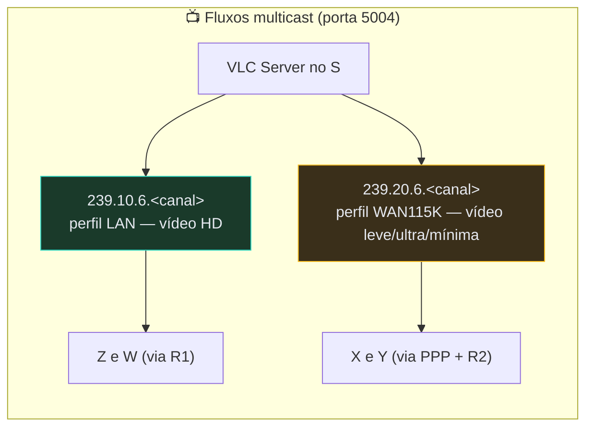

# Mini-IPTV Multicast com Controle de Banda WAN — Grupo 6

Projeto da disciplina **FRC — Fundamentos de Redes de Computadores** (UnB/FGA).
Scripts de configuração por máquina: leve o repositório para cada PC (pendrive/git) e rode na ordem.

## Topologia





<details>
<summary>Versão ASCII (para quem lê no terminal)</summary>

```
                [ Rede do Laboratório (Internet, Z e W) ]
                                |
                                | USB->Eth (Source NAT)
[ Host S ] -----cabo----- [ Roteador R1 ] ==serial PPP 115200== [ Roteador R2 ]
 172.16.0.2                172.16.0.1 / 10.0.0.1                 10.0.0.2 / 192.168.0.1
 DNS SMTP VLC backend      Apache proxy/API-GW, NAT, tc          DHCP, multicast
                                                                      |
                                                               [ X ]  [ Y ]  (DHCP .100-.200)
```

</details>

Multicast (grupo 6): `239.10.6.x` = perfil LAN (Z/W, vídeo HD) · `239.20.6.x` = perfil WAN115K (X/Y, vídeo leve) · porta 5004.

## Como usar

```bash
sudo bash run.sh        # menu inteligente por máquina
```

Na **primeira execução** o menu pergunta que máquina é aquela (S, R1, R2 ou X/Y) e grava a escolha
em `/etc/miniiptv.maquina` (fora do repositório — o pendrive roda em várias máquinas sem confundir).
Das próximas vezes ele mostra **só o que se aplica àquela máquina**: os scripts de configuração na
ordem certa, os testes recomendados para ela, o RESET e a opção *trocar de máquina* (se errar a escolha).

Ou rode direto (os nomes têm número = ordem):

| Máquina | Ordem | Script | Faz o quê |
|---|---|---|---|
| S  | 1 | `servidor-s/s-1-lan.sh` | IP 172.16.0.2 + gateway R1 |
| R1 | 1 | `roteador-r1/r1-1-lan.sh` | IP 172.16.0.1 + uplink Lab (DHCP) |
| R2 | 1 | `roteador-r2/r2-1-lan.sh` | IP 192.168.0.1 |
| R2 | 2 | `roteador-r2/r2-2-ppp.sh` | WAN PPP (rodar ANTES do R1) |
| R1 | 2 | `roteador-r1/r1-2-ppp.sh` | WAN PPP + rota p/ LAN#2 |
| R1 | 3 | `roteador-r1/r1-3-nat.sh` | SNAT/DNAT/firewall |
| R2 | 3 | `roteador-r2/r2-3-dhcp.sh` | DHCP p/ X e Y |
| R1 | 4 | `roteador-r1/r1-4-multicast.sh` | smcroute LAN/WAN |
| R2 | 4 | `roteador-r2/r2-4-multicast.sh` | smcroute WAN->LAN#2 |
| R1 | 5 | `roteador-r1/r1-5-tc.sh` | tc 115200 bps na WAN |
| S  | 2 | `servidor-s/s-2-dns.sh` | BIND9 zona grupo6.unb |
| S  | 3 | `servidor-s/s-3-email.sh` | Postfix+Dovecot TLS (IMAP/POP3) |
| S  | 4 | `servidor-s/s-4-backend.sh` | Backend Mini-IPTV (Flask+systemd) |
| R1 | 6 | `roteador-r1/r1-6-web.sh` | Apache: intranet + API Gateway HTTP/HTTPS + frontend |
| X/Y| 1 | `cliente-x/x-1-dhcp.sh` | DHCP + DNS -> S |
| todas | — | `testes/t-1-conectividade.sh` | camada IP: pings de todos os saltos, NAT, DNS |
| X/Y + S (+R1/R2) | — | `testes/t-2-multicast.sh` | multicast fim a fim com iperf (emissor/receptor/roteador) |
| X/Y | — | `testes/t-3-servicos.sh` | DNS, intranet/API-Gateway HTTP+HTTPS, SMTP/IMAP/POP3, DHCP |
| S (ou X/Y) | — | `testes/t-4-backend.sh` | bateria completa da aplicação (41 testes: JWT, perfis, WAN, upload, qualidades, painel) |
| R1 | — | `testes/t-5-wan.sh` | enlace PPP: tc 115200, latência x tamanho de pacote, drops |

**Ordem recomendada no lab:** R2(1,2) → R1(1,2,3) → S(1,2,3,4) → R2(3,4) → R1(4,5,6) → X/Y(1) → testes.

### Onde rodar cada teste

| Teste | Onde rodar | Por quê |
|---|---|---|
| **t-1** | **em cada máquina** (S, R1, R2, X, Y) | cada uma tem uma visão diferente da rede; o teste completo é a soma — em X/Y valida a travessia da WAN, no S valida o caminho contrário |
| **t-2** | **3 máquinas ao mesmo tempo**: 1º receptor em X ou Y (perfil WAN) ou Z/W (perfil LAN) → 2º emissor no **S** → 3º contadores em **R1 e R2** | é um teste fim a fim: o tráfego nasce no S e precisa ser visto chegando no receptor, com os contadores do smcroute subindo nos roteadores |
| **t-3** | **X ou Y** (ideal) — os testes de DHCP só existem lá; em Z/W ou S também vale (DHCP sai `[PULADO]`) | valida os serviços do ponto de vista do cliente final: DNS no S, web/gateway no R1, e-mail no S |
| **t-4** | **S** para a bateria completa (confere processos VLC, arquivos convertidos e systemd); repita em **X/Y** para validar o caminho via API Gateway | ele acha a API sozinho: no S usa `localhost:8000`; nas outras máquinas usa `r1.grupo6.unb/api` e pula os testes locais |
| **t-5** | **R1** (é onde estão o `tc` e o ppp0 com estatísticas); em X/Y roda só a parte de travessia do enlace | valida a limitação de 115200 bps: qdisc, drops e o RTT crescendo com o tamanho do pacote |

Todos imprimem `[PULADO]` no que não se aplica à máquina onde rodaram — nunca é erro rodar no lugar "errado".

## Deu problema? Reset total

`sudo bash NetworkConfig/scripts/reset-maquina.sh` (ou opção **RESET** no menu) desfaz tudo que o projeto configurou naquela máquina — PPP, IPs fixos, rotas, NAT, DHCP server, multicast, tc, resolv.conf — e religa o NetworkManager, **restaurando a Internet normal do Lab**. Depois é só remontar rodando os scripts na ordem.

## Observações

- Os scripts **param o NetworkManager** antes de configurar (senão ele desfaz IP/rotas/resolv.conf).
- Todos são **idempotentes**: limpam o estado anterior antes de aplicar — rode de novo sem medo.
- Pacotes (bind9, postfix, smcroute...) são instalados pelo próprio script quando faltam — instale **enquanto a máquina ainda tem Internet** (a WAN de 115200 bps não serve para apt).
- Vídeos: copie `filme.mp4`, `aula.mp4`, `show.mp4` para `/opt/miniiptv/videos` (o s4 converte p/ as versões WAN).
- Usuários da aplicação: `admin/admin123`, `aluno1/senha1` … `aluno4/senha4`.
- **Qualidades WAN**: além da versão *leve* (80 kb/s, comando da spec), o backend gera *ultra*
  (~20 kb/s: vídeo 12k @ 5 fps 160x120 + áudio 8k) e *mínima* (~12 kb/s: vídeo 6k @ 3 fps 128x96 +
  áudio 6k). O PPP de 115200 bps perde muita banda com o overhead TS/UDP/PPP, então na prática só as
  versões bem ruins passam sem travar no cabo serial — o cliente WAN escolhe no frontend (ou via
  `POST /api/canais/<n>/assistir` com `{"qualidade":"ultra"}` / `{"qualidade":"minima"}`).
  Se os presets mudarem, o s4 apaga e regera os `_uld`/`_min` automaticamente na próxima execução.
- O JWT é gerado com `hmac`/`base64` da biblioteca padrão (sem PyJWT — o `python3-jwt` do apt é a
  versão 1.x, que retorna `bytes` e quebrava o `jsonify`).
